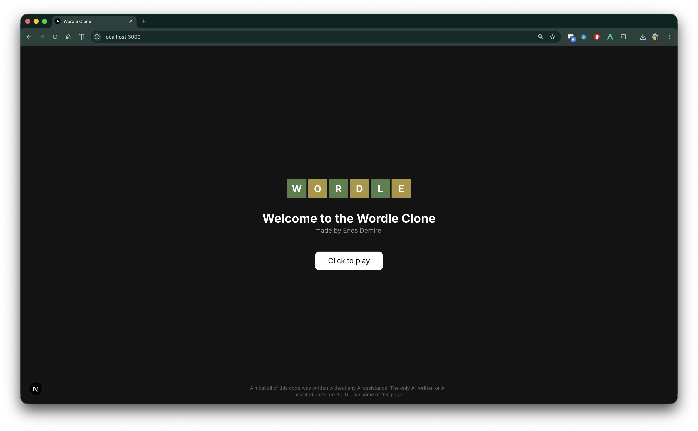
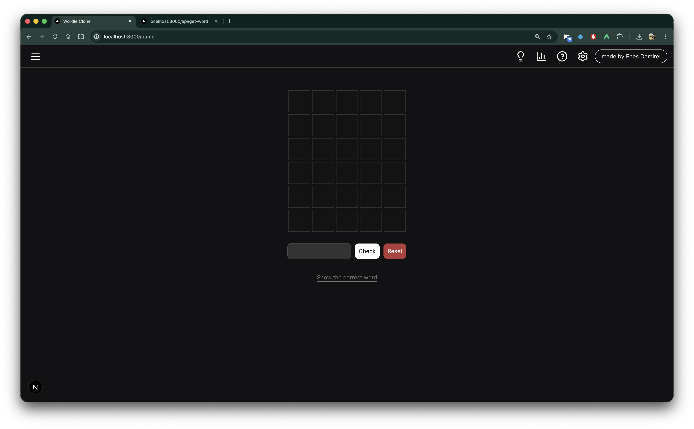
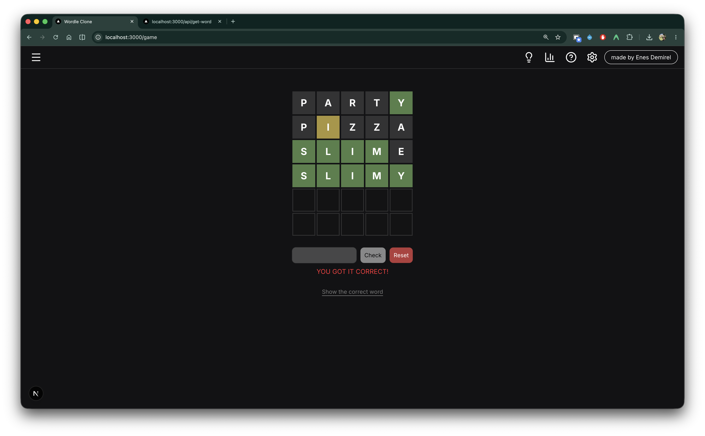

# Wordle Clone

> **Note on this README:** this file was written by AI. The project code itself is almost all mine, and the only AI-assisted parts are some of the UI.

> A personal project: a Wordle clone split into a Next.js frontend and a FastAPI backend that owns the word list.



## Stack

| Part        | Tech                                          |
| ----------- | --------------------------------------------- |
| Frontend    | Next.js 16 (App Router), React 19, TypeScript |
| Styling     | Tailwind CSS v4, shadcn/ui, lucide-react      |
| HTTP client | axios                                         |
| Backend     | Python, FastAPI, uvicorn                      |
| Word data   | plain text files                              |

## Structure

```
apps/
  api/                  FastAPI service
    main.py             endpoints
    words.txt           5-letter word list (~3k words)
    popular.txt         source list of common English words
    filter_words.py     script that produced words.txt from popular.txt
    old-words/          earlier dictionaries, no longer used
  web/                  Next.js app
    app/page.tsx        landing page
    app/game/           game route (layout, navbar, board)
    app/api/            route handlers proxying to FastAPI
    components/ui/      shadcn primitives
  assets/               screenshots
```

## API

FastAPI loads `words.txt` into memory at startup.

| Method | Route                | Response                            |
| ------ | -------------------- | ----------------------------------- |
| GET    | `/get-word`          | `{"word": "abbey"}`, a random word  |
| GET    | `/check-word/{word}` | `{"valid": true}`, membership check |

Answer and dictionary come from the same list, so every possible answer is also an accepted guess.

The list came from `popular.txt` (~25k common English words) rather than a full dictionary. `filter_words.py` pulls out the 5-letter entries into `words.txt`, which keeps answers to everyday words.

## Request flow

The browser never calls FastAPI directly. Next.js route handlers sit in between, read `NEXT_PUBLIC_API_URL`, forward the request, and normalize failures into a JSON error.

```
board (client) → /api/get-word            → FastAPI /get-word
               → /api/check-word/[word]   → FastAPI /check-word/{word}
```



## Game

Six guesses, five letters. Tile colors come from a per-letter result grid: green for correct position, yellow for right letter wrong position, gray for absent. Duplicate letters are scored against a frequency map of the answer, so a repeated letter only lights up as many times as it actually appears.



## Configuration

`apps/web/.env`:

```
NEXT_PUBLIC_API_URL=http://127.0.0.1:8000
```

## Running locally

Backend:

```bash
cd apps/api
pip install -r requirements.txt
uvicorn main:app --reload
```

Frontend:

```bash
cd apps/web
npm install
npm run dev
```
